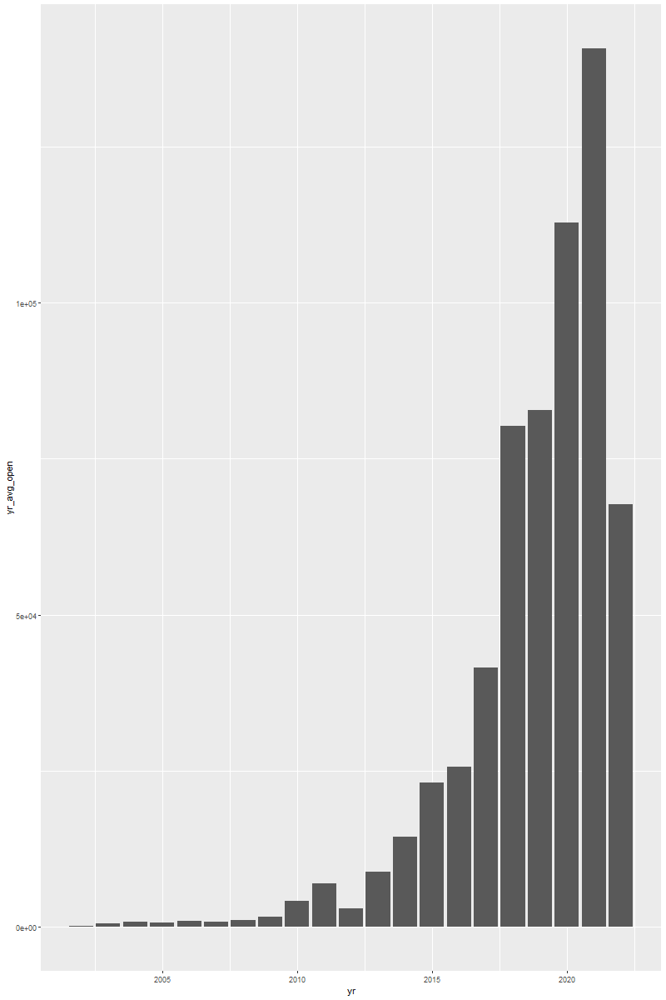
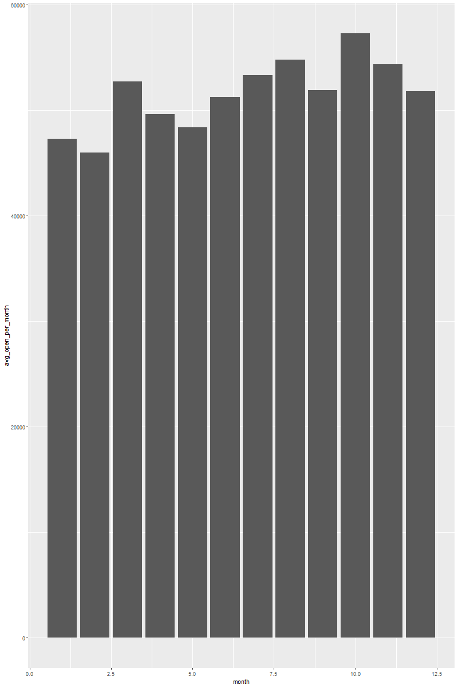

# Overview

I chose to do this project so that I could get some brief experience using the R programming language.  

Like my data analysis project, I used a stock market dataset from Kaggle.com. This time though, I only used data on Netflix so that the download of the dataset was much faster. I was able to learn quite a bit and enjoyed programming in this language. 

Work done: Practiced with r syntax, made some new columns to get further knowldedge of the dataset, and got two visualizations up. 

[Software Demo Video](https://youtu.be/pn3aRgHPn7A)

# Visuals

   

   

# Github Link

- https://github.com/blakedennett/R

